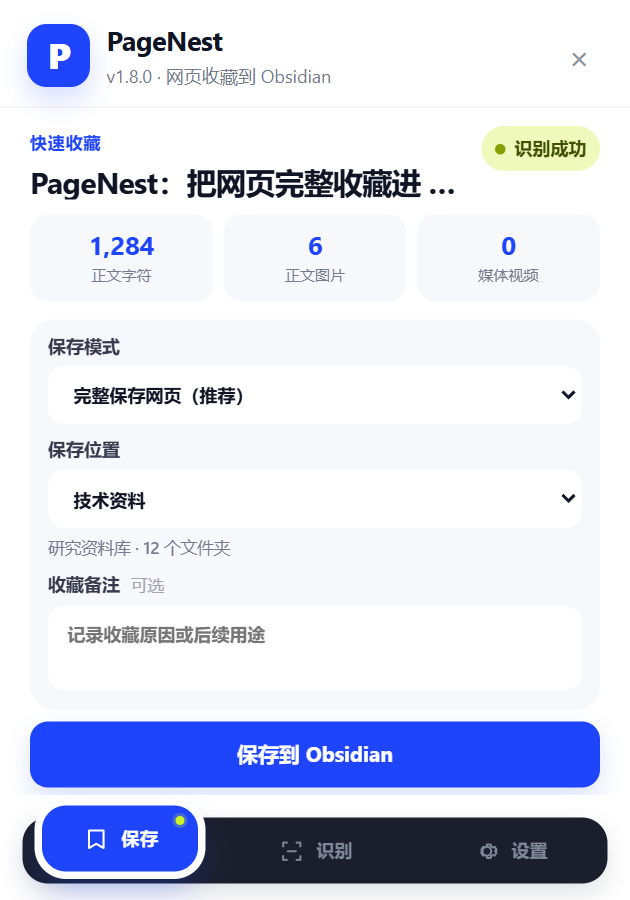
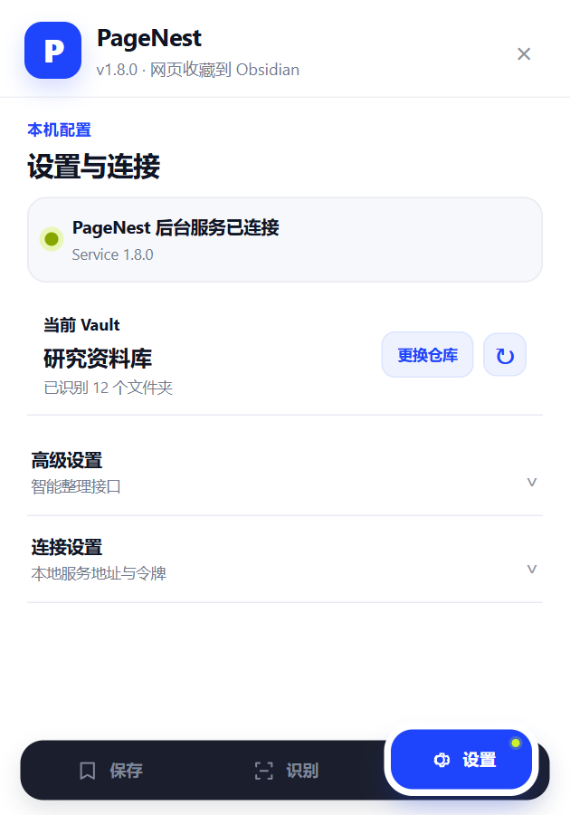
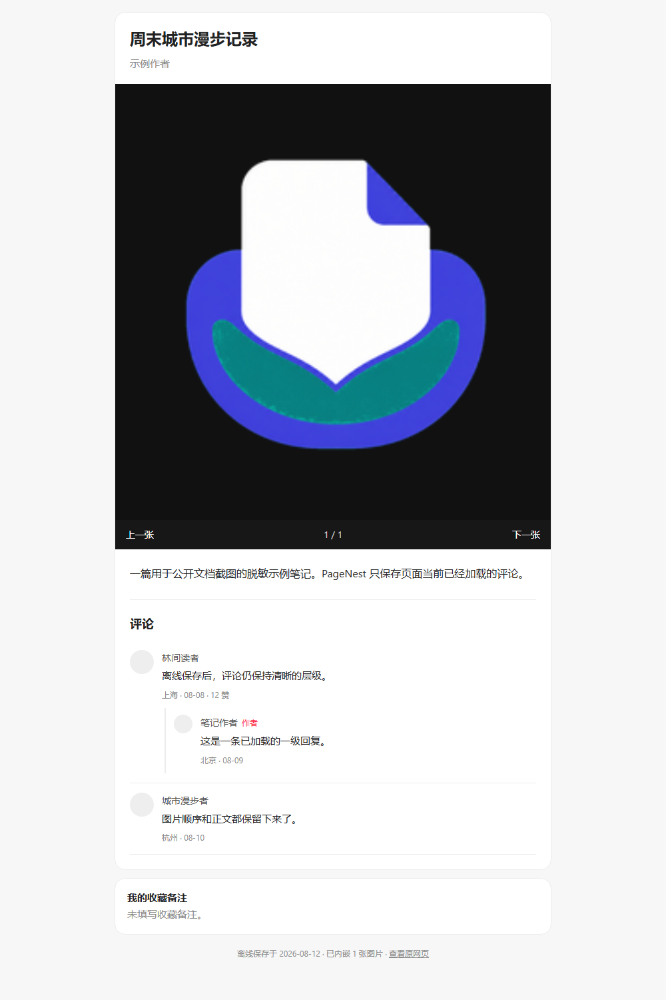
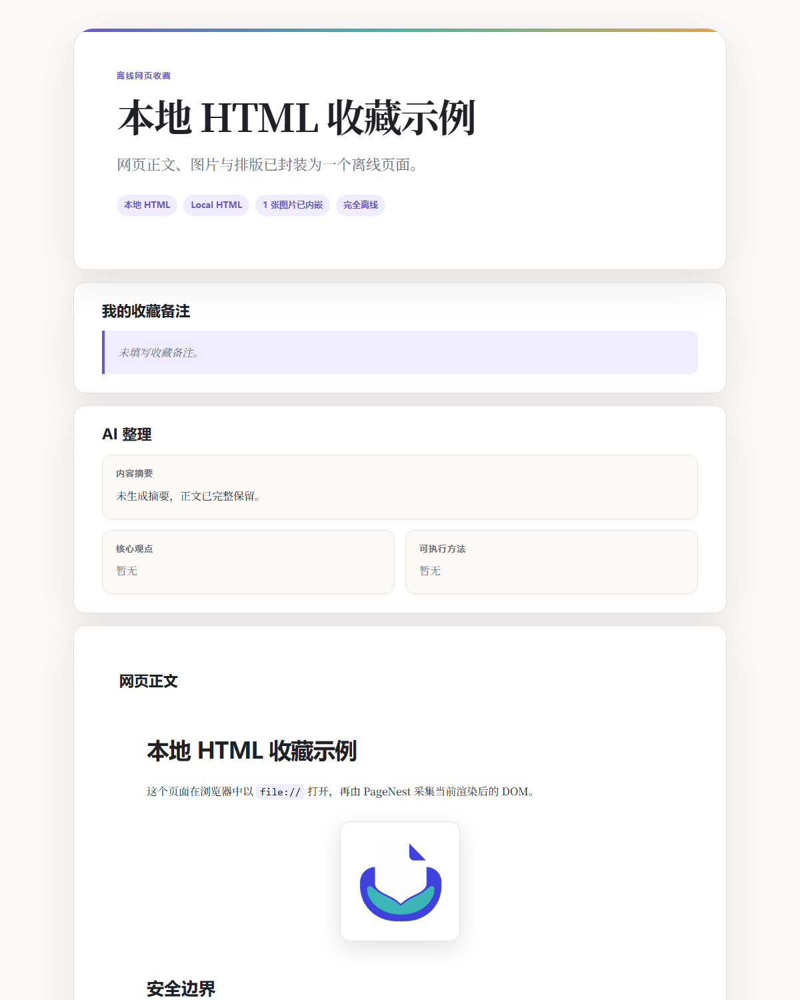
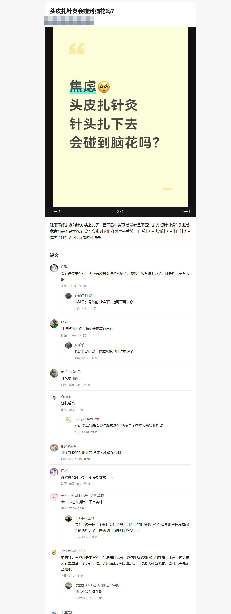
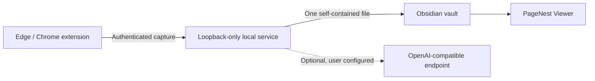

<p align="center"></p>
<h1 align="center">PageNest</h1>
<p align="center"><strong>Save webpages into Obsidian as self-contained offline files.</strong></p>
<p align="center">Text, images, code, links, and loaded content are saved together. Ordinary capture needs neither AI nor a separate Python installation.</p>

<p align="center">
  <a href="https://github.com/WYuHuai/PageNest/actions/workflows/ci.yml"></a>
  
  
  <a href="LICENSE"></a>
</p>

<p align="center">
  <a href="README.zh-CN.md">简体中文</a> ·
  <a href="https://github.com/WYuHuai/PageNest/releases">Download</a> ·
  <a href="#install-in-3-steps">Install</a> ·
  <a href="docs/supported-sites.md">Supported sites</a> ·
  <a href="docs/troubleshooting.md">Troubleshooting</a>
</p>

<p align="center"></p>

PageNest is a local-first web collector for Windows, Edge/Chrome, and Obsidian.
Click the extension on a page and PageNest creates one portable `.pagenest`
file in your vault—without a sidecar asset folder.

## Why PageNest

- **One page, one file.** Article text, original-position images, code, links,
  GIFs, and supported media are embedded into one offline file.
- **Local-first.** Ordinary capture goes from the browser to the loopback-only
  PageNest service and then to your Obsidian vault.
- **Readable in Obsidian.** PageNest Viewer opens `.pagenest` files and remains
  compatible with legacy `.hermes` collections.
- **AI is optional.** Saving the original page does not require an API key or
  send the page to an AI provider.

## Highlights in v1.8.0

### One page, one file

Every collected webpage becomes one self-contained `.pagenest` file. There is
no neighboring attachment directory to move, rename, or lose.

### Local-first

```text
Edge / Chrome → PageNest Local Service → Obsidian vault
```

The service listens on `127.0.0.1`. Ordinary collection does not upload the
page to a PageNest server and PageNest contains no telemetry.

### Local HTML

PageNest can collect `file://*.html` pages that you explicitly open in
Edge/Chrome, including HTML generated by tools such as ChatGPT, Codex, or
Claude. It captures the current rendered DOM and browser-readable images.
Local absolute paths are not sent to the service, and the service is not given
general access to the local filesystem.

### Change Vault anytime

After installation, open **Settings → Current Vault → Change Vault** to choose
another Obsidian vault. New collections go to the new vault; PageNest does not
move or delete anything in the old vault.

### Structured Xiaohongshu comments

For supported Xiaohongshu notes, PageNest preserves currently loaded comment
avatars, names, text, time, location, likes, and first-level replies. It does
not automatically expand the complete comment tree.

## Core features

- Generic article capture plus dedicated paths for Xiaohongshu, Guyue,
  Feishu/Lark, WeChat, CSDN, and Bilibili.
- Original-position images, animated GIFs, headings, tables, code blocks,
  external repository links, and personal collection notes.
- Image carousel and best-effort structured comments for Xiaohongshu.
- Current and legacy Guyue article DOMs, including
  `.detail-fuwenben .html`.
- Protected Feishu images through the signed-in browser context and Canvas
  visual fallback.
- Bilibili metadata and bounded media capture for supported public pages.
- Duplicate-safe saves and atomic file writes.
- Optional OpenAI-compatible organization; original content still saves when
  the AI endpoint fails.

## Install in 3 steps

> Current platform status: the real workflow has been tested on a Windows 11
> host and in Windows CI, and an automated Windows Sandbox installer smoke test
> passes. A persistent clean-VM restart cycle is not complete, and Windows 10
> has not been fully validated.

### 1. Install PageNest

Download `PageNest-Setup-1.8.0.exe` and its checksum from
[GitHub Releases](https://github.com/WYuHuai/PageNest/releases), verify the
SHA-256 value, run the installer, and select an existing Obsidian vault.

- No Python installation required.
- No Node.js installation required.
- No manual token setup required.
- The local service starts after installation and at Windows sign-in.

The installer is currently unsigned. Windows SmartScreen may display
**Unknown publisher**; PageNest does not require disabling Microsoft Defender.

### 2. Load the browser extension

Until the Edge Add-ons listing is published:

1. Open `edge://extensions/` (or `chrome://extensions/`).
2. Enable **Developer mode**.
3. Choose **Load unpacked**.
4. Select `%LOCALAPPDATA%\Programs\PageNest\Extension`.

### 3. Enable PageNest Viewer

Restart Obsidian, open **Settings → Community plugins**, and enable
**PageNest Viewer**. Then open a webpage, click PageNest, and choose
**Save to Obsidian**.

### Change the Obsidian vault

Open **PageNest → Settings → Current Vault → Change Vault**, then select the
new vault. The selection persists after restart. Existing files stay in the
old vault; only future collections use the new destination.

For detailed recovery steps, read the
[installation guide](docs/安装说明.html) and
[troubleshooting guide](docs/troubleshooting.md).

## Supported sites

| Site or page type | Current support |
| --- | --- |
| Generic article pages | Main content, headings, images, links, code, best-effort layout |
| Local HTML | Current rendered DOM, code, tables, links, and browser-readable images |
| Xiaohongshu | Image notes, carousels, asynchronous content, and currently loaded structured comments; best effort |
| Guyue | Current article DOM and legacy `.detail-fuwenben .html`, including text and images |
| Feishu / Lark | Virtual blocks, signed-in images, embedded frames, Canvas visual fallback |
| WeChat Official Accounts | Article cleanup, lazy images, placeholder filtering |
| CSDN | Article layout, syntax colors, code controls, external repository links |
| Bilibili | Video pages, columns, dynamics, metadata, supported media capture |

Website layouts can change without notice. See the detailed
[support matrix and limitations](docs/supported-sites.md).

## Local HTML

Enable **Allow access to file URLs** for the PageNest extension, open the HTML
file in the browser, then save it like any other page. The saved page does not
execute source JavaScript, and complex source CSS is not guaranteed to match
pixel-for-pixel.

## Optional AI organization

PageNest supports user-configured OpenAI Chat Completions-compatible endpoints.
The model name is entered explicitly. AI is used only when an AI organization
mode is selected; an AI failure does not prevent saving the original article
and successfully downloaded images.

## Screenshots

All examples below use the real PageNest UI or renderer with sanitized sample
content. They contain no personal vault path, token, API key, or account data.

<table>
  <tr>
    <td width="50%"><br><sub>Save screen and floating navigation</sub></td>
    <td width="50%"><br><sub>Service, Vault switching, and refresh controls</sub></td>
  </tr>
  <tr>
    <td width="50%"><br><sub>Sanitized Xiaohongshu carousel and structured comments</sub></td>
    <td width="50%"><br><sub>Local HTML saved as one offline file</sub></td>
  </tr>
  <tr>
    <td colspan="2" align="center"><br><sub>Self-contained page rendered by PageNest Viewer</sub></td>
  </tr>
</table>

## How it works



The extension extracts the active page. The local service validates the
request, sanitizes the content, downloads allowed resources, optionally
organizes it, and atomically writes the result. PageNest Viewer renders the
offline document inside a restricted iframe.

## Privacy and security

- The service binds only to `127.0.0.1` and requires a local bearer token.
- Extension origins are restricted by CORS.
- Remote downloads reject unsafe schemes, credentials, private addresses,
  cloud metadata targets, and unsafe redirects by default.
- Request, article, image, media, item-count, and concurrency limits are
  enforced.
- Captured page scripts are not executed in the Viewer.
- Code copying uses a random, per-render message channel.

Read [Security](SECURITY.md), [Privacy](PRIVACY.md), and
[Architecture](docs/architecture.md) for the complete boundaries.

## Known limitations

- Windows 10 has not been fully validated; a persistent clean Windows 11 VM
  restart and sign-in cycle has not been completed.
- The installer is unsigned and may trigger a SmartScreen **Unknown publisher**
  warning.
- Dedicated site adapters can temporarily break after a website DOM change.
- Xiaohongshu comments include only content already loaded by the website;
  logged-in behavior has not been fully tested.
- DRM, protected resources, expiring URLs, or strict anti-hotlinking may prevent
  some media from being saved.
- Complex local HTML does not execute source JavaScript, and original CSS is
  not guaranteed to reproduce 1:1.

## Development and contributing

```powershell
python -m venv local-server\.venv
local-server\.venv\Scripts\python -m pip install -r local-server\requirements-dev.txt
local-server\.venv\Scripts\python -m pytest -q

Get-ChildItem extension,obsidian-plugin,tests -Recurse -Filter *.js |
  ForEach-Object { node --check $_.FullName }
Get-ChildItem tests -Filter "test_*.js" |
  ForEach-Object { node $_.FullName }
```

Focused bug reports and pull requests are welcome. Read
[CONTRIBUTING.md](CONTRIBUTING.md) and do not attach private pages, vault
contents, API keys, or unsanitized logs.

### Advanced documentation

- [Architecture and data flow](docs/architecture.md)
- [Version compatibility](docs/version-compatibility.md)
- [Release checklist](docs/release-checklist.md)
- [v1.8.0 compatibility matrix](docs/COMPATIBILITY_MATRIX_1.8.0.md)
- [v1.8.0 release sign-off](docs/RELEASE_SIGNOFF_1.8.0.md)
- [v1.8.0 release artifacts](docs/RELEASE_ARTIFACTS_1.8.0.md)
- [Roadmap](ROADMAP.md)

## License

[MIT](LICENSE)
