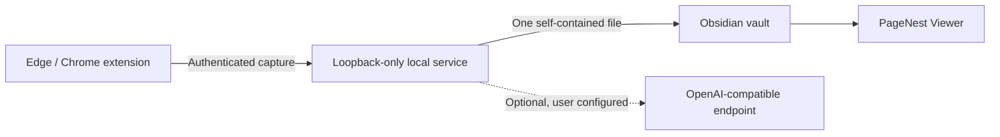

<h1 align="center">PageNest</h1>

<strong>Keep the webpage—not just the text.</strong>

Save a webpage as one self-contained <code>.pagenest</code> file, then reopen it inside Obsidian with a dedicated web-style Viewer.

  
  
  
  
  

  <a href="README.zh-CN.md">简体中文</a> ·
  <a href="https://github.com/WYuHuai/PageNest/releases/download/v1.8.0/PageNest-Setup-1.8.0.exe">Download installer</a> ·
  <a href="#install-in-3-steps">Install</a> ·
  <a href="docs/supported-sites.md">Supported sites</a> ·
  <a href="docs/troubleshooting.md">Troubleshooting</a>

PageNest is a local-first web collector for Windows, Edge/Chrome, and Obsidian.
Click the extension on a page and PageNest creates one portable `.pagenest`
file in your vault—without a sidecar asset folder.

## Web clipping without flattening the web

Most web clippers are designed to turn a page into a Markdown note. PageNest
takes a different approach: it preserves the collected page as an offline
document and gives Obsidian a dedicated Viewer for reading it.

| | Typical Markdown clipper | PageNest |
| --- | --- | --- |
| Saved result | Converted `.md` note | Self-contained `.pagenest` page |
| Images and loaded media | References or attachment folders | Embedded into the page when available |
| Reading in Obsidian | Markdown document | Dedicated web-style Viewer |
| Moving the collection | Move the note and its assets together | Move one portable file |
| AI requirement | Depends on the tool | Not required for ordinary capture |

PageNest does not promise a pixel-perfect copy of every website. Its goal is
to preserve more of the useful webpage experience—while keeping the result
local, portable, and readable inside your vault.

The page remains a page: text, images, code, links, layout, and personal notes stay together in one portable file.

## What PageNest preserves

- Article structure, original-position images, GIFs, tables, code blocks,
  links, supported media, and your collection note.
- Dedicated capture for Xiaohongshu, Guyue, Feishu/Lark, WeChat, CSDN, and
  Bilibili, plus a generic article path for other sites.
- Local HTML files explicitly opened in Edge/Chrome, including the rendered
  DOM and browser-readable images.
- Currently loaded Xiaohongshu comments and image carousels on supported notes.
- Duplicate-safe, atomic saves. Optional OpenAI-compatible organization never
  blocks saving the original page when the AI endpoint fails.

## Install in 3 steps

> Current platform status: the real workflow has been tested on a Windows 11
> host and in Windows CI, and an automated Windows Sandbox installer smoke test
> passes. A persistent clean-VM restart cycle is not complete, and Windows 10
> has not been fully validated.

### 1. Install PageNest

Download [`PageNest-Setup-1.8.0.exe`](https://github.com/WYuHuai/PageNest/releases/download/v1.8.0/PageNest-Setup-1.8.0.exe)
and its [SHA-256 checksum](https://github.com/WYuHuai/PageNest/releases/download/v1.8.0/PageNest-Setup-1.8.0.exe.sha256),
verify the checksum, run the installer, and select an existing Obsidian vault.
Windows users should use this installer rather than clone the source repository.

- No Python installation required.
- No Node.js installation required.
- No manual token setup required.
- The local service starts after installation and at Windows sign-in.

The installer is currently unsigned. Windows SmartScreen may display
**Unknown publisher**; PageNest does not require disabling Microsoft Defender.

### 2. Load the browser extension

Until the Edge Add-ons listing is published:

1. Open `edge://extensions/` (or `chrome://extensions/`).
2. Enable **Developer mode**.
3. Choose **Load unpacked**.
4. Select `%LOCALAPPDATA%\Programs\PageNest\Extension`.

### 3. Enable PageNest Viewer

Restart Obsidian, open **Settings → Community plugins**, and enable
**PageNest Viewer**. Then open a webpage, click PageNest, and choose
**Save to Obsidian**.

For detailed recovery steps, read the
[installation guide](docs/安装说明.html) and
[troubleshooting guide](docs/troubleshooting.md).

## Save and read a page

1. Open a supported webpage in Edge or Chrome.
2. Open PageNest, confirm the destination, and choose **Save to Obsidian**.
3. Find the new `.pagenest` file in the selected vault folder.
4. Open it in Obsidian; PageNest Viewer renders the offline page.

To collect a local HTML file, enable **Allow access to file URLs** in the
extension details first. To change vaults later, use **PageNest → Settings →
Current Vault → Change Vault**. Existing files remain in the old vault.

## Supported sites

| Site or page type | Current support |
| --- | --- |
| Generic article pages | Main content, headings, images, links, code, best-effort layout |
| Local HTML | Current rendered DOM, code, tables, links, and browser-readable images |
| Xiaohongshu | Image notes, carousels, asynchronous content, and currently loaded structured comments; best effort |
| Guyue | Current article DOM and legacy `.detail-fuwenben .html`, including text and images |
| Feishu / Lark | Virtual blocks, signed-in images, embedded frames, Canvas visual fallback |
| WeChat Official Accounts | Article cleanup, lazy images, placeholder filtering |
| CSDN | Article layout, syntax colors, code controls, external repository links |
| Bilibili | Video pages, columns, dynamics, metadata, supported media capture |

Website layouts can change without notice. See the detailed
[support matrix and limitations](docs/supported-sites.md).

## Screenshots

All examples below use the real PageNest UI or renderer with sanitized sample
content. They contain no personal vault path, token, API key, or account data.

<table>
  <tr>
    <td width="50%"> Save screen and floating navigation</td>
    <td width="50%"> Service, Vault switching, and refresh controls</td>
  </tr>
  <tr>
    <td width="50%"> Sanitized Xiaohongshu carousel and structured comments</td>
    <td width="50%"> Local HTML saved as one offline file</td>
  </tr>
</table>

## How it works

The extension extracts the active page. The local service validates the
request, sanitizes the content, downloads allowed resources, optionally
organizes it, and atomically writes the result. PageNest Viewer renders the
offline document inside a restricted iframe.

## Privacy and security

- The service binds only to `127.0.0.1` and requires a local bearer token.
- Extension origins are restricted by CORS.
- Remote downloads reject unsafe schemes, credentials, private addresses,
  cloud metadata targets, and unsafe redirects by default.
- Request, article, image, media, item-count, and concurrency limits are
  enforced.
- Captured page scripts are not executed in the Viewer.
- Code copying uses a random, per-render message channel.

Read [Security](SECURITY.md), [Privacy](PRIVACY.md), and
[Architecture](docs/architecture.md) for the complete boundaries.

## Known limitations

- Windows 10 has not been fully validated; a persistent clean Windows 11 VM
  restart and sign-in cycle has not been completed.
- The installer is unsigned and may trigger a SmartScreen **Unknown publisher**
  warning.
- Dedicated site adapters can temporarily break after a website DOM change.
- Xiaohongshu comments include only content already loaded by the website;
  logged-in behavior has not been fully tested.
- DRM, protected resources, expiring URLs, or strict anti-hotlinking may prevent
  some media from being saved.
- Complex local HTML does not execute source JavaScript, and original CSS is
  not guaranteed to reproduce 1:1.

## Documentation and contributing

- [Installation guide](docs/安装说明.html)
- [Troubleshooting](docs/troubleshooting.md)
- [Architecture and data flow](docs/architecture.md)
- [Version compatibility](docs/version-compatibility.md)
- [Roadmap](ROADMAP.md)
- [Contributing guide](CONTRIBUTING.md)

Focused bug reports and pull requests are welcome. Do not attach private pages,
vault contents, API keys, or unsanitized logs.

## License

[MIT](LICENSE)
