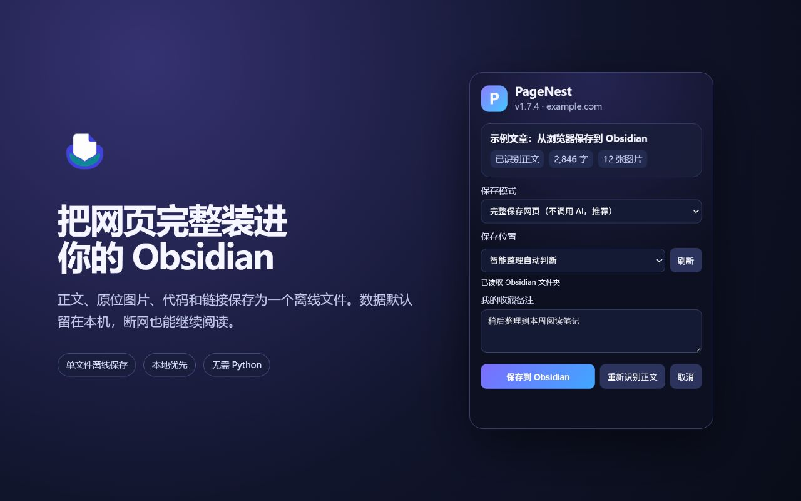
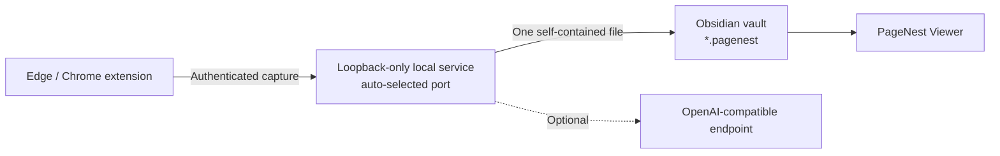

<p align="center"></p>
<h1 align="center">PageNest</h1>
<p align="center"><strong>Save complete webpages into Obsidian as single, offline files.</strong></p>
<p align="center">Keep the article, original images, code, links, GIFs, and supported video — locally, without installing Python.</p>

<p align="center">
  <a href="https://github.com/WYuHuai/PageNest/actions/workflows/ci.yml"></a>
  
  
  
  <a href="LICENSE"></a>
</p>

<p align="center">
  <a href="README.zh-CN.md">简体中文</a> ·
  <a href="https://github.com/WYuHuai/PageNest/releases">Download</a> ·
  <a href="#install-in-3-steps">Install</a> ·
  <a href="docs/supported-sites.md">Supported sites</a> ·
  <a href="docs/troubleshooting.md">Troubleshooting</a>
</p>

PageNest is a local-first web collector for Windows, Edge/Chrome, and Obsidian.
One click in the browser produces one self-contained `.pagenest` offline page
inside your vault. Optional AI organization works with OpenAI Chat
Completions-compatible endpoints; ordinary capture does not require AI.

## Install in 3 steps

**Requirements:** Windows 10 or 11, Microsoft Edge or Google Chrome, and
Obsidian 1.5.0 or newer.

### 1. Install PageNest

Download `PageNest-Setup-1.7.4.exe` and its `.sha256` file from
[GitHub Releases](https://github.com/WYuHuai/PageNest/releases). Verify the
checksum, run the installer, and select an existing Obsidian vault.

The installer includes the Python runtime and local service, creates a random
local token, configures the bundled extension, installs PageNest Viewer into
the selected vault, and starts the service at Windows sign-in. Users do not
install Python or edit `.env` files.

### 2. Add the browser extension

Until the browser-store build is approved, open `edge://extensions/` or
`chrome://extensions/`, enable **Developer mode**, choose **Load unpacked**, and
select:

```text
%LOCALAPPDATA%\Programs\PageNest\Extension
```

The installed extension is already paired with the local service.

### 3. Enable the Obsidian viewer

Restart Obsidian, open **Settings → Community plugins**, and enable
**PageNest Viewer**. The installer has already copied it into the selected
vault.

### Save your first page

1. Open an article in Edge or Chrome and click PageNest.
2. Choose a vault folder, then select **Save to Obsidian**.
3. Open the new `.pagenest` file in Obsidian.

If the extension cannot reach the service or the file does not appear, start
with [Troubleshooting](docs/troubleshooting.md).

## See it in action



## What it does

- Saves article text, layout, images, animated GIFs, links, and supported media
  into one `.pagenest` file without a sidecar asset folder.
- Keeps embedded content readable after the source page disappears or the
  computer goes offline.
- Preserves image positions, headings, code blocks, external repository links,
  and a separate personal collection note.
- Handles generic articles plus dedicated Feishu, WeChat, CSDN, and Bilibili
  capture paths.
- Downloads protected Feishu images through the signed-in browser context.
- Preserves Feishu canvas content and Bilibili video metadata; supported
  Bilibili media can be merged into a bounded 360p MP4.
- Discovers folders in the configured Obsidian vault.
- Offers original, quick text organization, and deep text-and-image organization
  modes.
- Saves the original article and downloaded images even when the optional AI
  endpoint fails.

## How the pieces fit



The extension reads the active page. The local service sanitizes the capture,
downloads allowed resources, optionally organizes it, and writes the final
file. The Obsidian plugin registers the `.pagenest` extension and renders the
offline document inside a restricted iframe.

See [Architecture and data flow](docs/architecture.md) for the security
boundaries.

## The `.pagenest` format

A `.pagenest` file is a sanitized, self-contained UTF-8 HTML document with
embedded assets and PageNest metadata. It is not encrypted and is intended as
an offline collection artifact rather than an editable Markdown note.

PageNest Viewer also registers the legacy `.hermes` extension, so
collections created before the PageNest rename continue to open.

The custom extension lets Obsidian route the file to the restricted PageNest
viewer and leaves room for future format metadata. A copied file can usually be
renamed to `.html` for emergency browser viewing, but the Obsidian viewer is the
supported path.

## Supported sites

| Site | Current support |
| --- | --- |
| Generic article pages | Main content, headings, images, links, code, best-effort layout |
| Feishu / Lark documents | Virtual blocks, signed images, embedded document frames, canvas fallback |
| WeChat Official Account articles | Article cleanup, lazy images, placeholder filtering |
| CSDN | Article layout, syntax colors, code folding/copy, external repository links |
| Bilibili | Video pages, columns and dynamics, metadata, supported media capture |

Read the detailed [support matrix and limitations](docs/supported-sites.md).

## Browser permissions

| Permission | Why PageNest needs it |
| --- | --- |
| `activeTab` | Identify and capture the page the user explicitly opens |
| `scripting` | Run the extractor and site adapter in that page |
| `storage` | Remember the local service address, token, and user settings |
| `clipboardWrite` | Copy paths and code when the user asks |
| `<all_urls>` | Capture arbitrary article sites and signed page resources |

Captured content is sent only to the configured local service and, when the
user selects an AI mode, to the organizer endpoint configured by that user.
PageNest contains no telemetry or analytics.

## Security model

- The service binds only to `127.0.0.1`. The Windows installer selects the
  first available port from `8765`, `18765`, and `28765`, and the store
  extension discovers the same candidates automatically.
- API requests require a local bearer token.
- CORS accepts Chromium extension origins rather than arbitrary websites.
- Remote downloads reject unsafe schemes, credentials, loopback, private,
  link-local, and cloud metadata destinations by default.
- Redirects and download sizes are checked while streaming.
- Article, request, image, media, count, and concurrency limits are enforced.
- The viewer does not execute captured page scripts or load remote images.
- Code copying uses a random, per-render message channel.

See [SECURITY.md](SECURITY.md) and [PRIVACY.md](PRIVACY.md).

## Development

```powershell
python -m venv local-server\.venv
local-server\.venv\Scripts\python -m pip install -r local-server\requirements-dev.txt
local-server\.venv\Scripts\python -m pytest -q

Get-ChildItem extension,obsidian-plugin,tests -Recurse -Filter *.js |
  ForEach-Object { node --check $_.FullName }
Get-ChildItem tests -Filter "test_*.js" |
  ForEach-Object { node $_.FullName }
```

Additional release checks and packaging are documented in
[the release checklist](docs/release-checklist.md).

## Project status

Current component versions are listed in
[Version compatibility](docs/version-compatibility.md). Known limitations and
planned work are tracked in [ROADMAP.md](ROADMAP.md).

## Contributing

Focused bug reports and pull requests are welcome. Read
[CONTRIBUTING.md](CONTRIBUTING.md) before submitting changes. Do not attach
private pages, vault contents, API keys, or unsanitized logs.

## License

[MIT](LICENSE)
