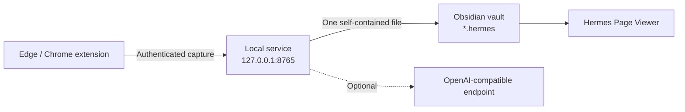

# Hermes Obsidian Web Collector

[简体中文](README.zh-CN.md) · [Installation](#quick-start) ·
[Supported sites](docs/supported-sites.md) ·
[Architecture](docs/architecture.md) · [Roadmap](ROADMAP.md)

Hermes is a local-first web collector for Windows, Edge/Chrome, and Obsidian.
It captures an article in the browser, builds one self-contained `.hermes`
offline page through a local service, and opens that page safely in Obsidian.
Optional organization works with OpenAI Chat Completions-compatible endpoints.

> Hermes has three required components: a browser extension, a Windows local
> service, and an Obsidian page viewer. Installing only the browser extension is
> not enough.

## What it does

- Saves article text, layout, images, animated GIFs, links, and supported media
  into one `.hermes` file without a sidecar asset folder.
- Keeps embedded content readable after the source page disappears or the
  computer goes offline.
- Preserves image positions, headings, code blocks, external repository links,
  and a separate personal collection note.
- Handles generic articles plus dedicated Feishu, WeChat, CSDN, and Bilibili
  capture paths.
- Downloads protected Feishu images through the signed-in browser context.
- Preserves Feishu canvas content and Bilibili video metadata; supported
  Bilibili media can be merged into a bounded 360p MP4.
- Discovers folders in the configured Obsidian vault.
- Offers original, quick text organization, and deep text-and-image organization
  modes.
- Saves the original article and downloaded images even when the optional AI
  endpoint fails.

## How the pieces fit



The extension reads the active page. The local service sanitizes the capture,
downloads allowed resources, optionally organizes it, and writes the final
file. The Obsidian plugin registers the `.hermes` extension and renders the
offline document inside a restricted iframe.

See [Architecture and data flow](docs/architecture.md) for the security
boundaries.

## Quick start

### Requirements

- Windows 10 or 11
- Python 3.11 or newer
- Microsoft Edge or Google Chrome
- Obsidian 1.5.0 or newer

### 1. Install the local service

1. Download and extract the Windows local-service package.
2. Run `安装依赖.bat`.
3. Open `local-server\.env`.
4. Set `OBSIDIAN_VAULT_PATH` to an absolute vault path.
5. Generate a token in PowerShell:

   ```powershell
   [guid]::NewGuid().ToString("N")
   ```

6. Put the value in `LOCAL_COLLECTOR_TOKEN`.
7. Run `启动网页收藏器.bat`.

Never share or commit `local-server\.env`.

### 2. Install the browser extension

1. Open `edge://extensions/` or `chrome://extensions/`.
2. Enable Developer mode.
3. Extract the browser-extension package.
4. Choose **Load unpacked** and select the extracted folder containing
   `manifest.json`.
5. Open the Hermes popup, expand connection settings, and enter
   `http://127.0.0.1:8765` plus the same collector token.

### 3. Install the Obsidian viewer

1. Extract the viewer package to:

   ```text
   <vault>\.obsidian\plugins\hermes-page-viewer\
   ```

2. Confirm that the folder directly contains `main.js`, `manifest.json`, and
   `styles.css`.
3. Restart Obsidian and enable **Hermes Page Viewer** under Community plugins.

Without this plugin, Obsidian does not know how to open `.hermes` files.

## The `.hermes` format

A `.hermes` file is a sanitized, self-contained UTF-8 HTML document with
embedded assets and Hermes metadata. It is not encrypted and is intended as an
offline collection artifact rather than an editable Markdown note.

The custom extension lets Obsidian route the file to the restricted Hermes
viewer and leaves room for future format metadata. A copied file can usually be
renamed to `.html` for emergency browser viewing, but the Obsidian viewer is the
supported path.

## Supported sites

| Site | Current support |
| --- | --- |
| Generic article pages | Main content, headings, images, links, code, best-effort layout |
| Feishu / Lark documents | Virtual blocks, signed images, embedded document frames, canvas fallback |
| WeChat Official Account articles | Article cleanup, lazy images, placeholder filtering |
| CSDN | Article layout, syntax colors, code folding/copy, external repository links |
| Bilibili | Video pages, columns and dynamics, metadata, supported media capture |

Read the detailed [support matrix and limitations](docs/supported-sites.md).

## Browser permissions

| Permission | Why Hermes needs it |
| --- | --- |
| `activeTab`, `tabs` | Identify and capture the page the user explicitly opens |
| `scripting` | Run the extractor and site adapter in that page |
| `storage` | Remember the local service address, token, and user settings |
| `clipboardWrite` | Copy paths and code when the user asks |
| `<all_urls>` | Capture arbitrary article sites and signed page resources |

Captured content is sent only to the configured local service and, when the
user selects an AI mode, to the organizer endpoint configured by that user.
Hermes contains no telemetry or analytics.

## Security model

- The service binds to `127.0.0.1:8765`.
- API requests require a local bearer token.
- CORS accepts Chromium extension origins rather than arbitrary websites.
- Remote downloads reject unsafe schemes, credentials, loopback, private,
  link-local, and cloud metadata destinations by default.
- Redirects and download sizes are checked while streaming.
- Article, request, image, media, count, and concurrency limits are enforced.
- The viewer does not execute captured page scripts or load remote images.
- Code copying uses a random, per-render message channel.

See [SECURITY.md](SECURITY.md) and [PRIVACY.md](PRIVACY.md).

## Development

```powershell
python -m venv local-server\.venv
local-server\.venv\Scripts\python -m pip install -r local-server\requirements-dev.txt
local-server\.venv\Scripts\python -m pytest -q

Get-ChildItem extension,obsidian-plugin,tests -Recurse -Filter *.js |
  ForEach-Object { node --check $_.FullName }
Get-ChildItem tests -Filter "test_*.js" |
  ForEach-Object { node $_.FullName }
```

Additional release checks and packaging are documented in
[the release checklist](docs/release-checklist.md).

## Project status

Current component versions are listed in
[Version compatibility](docs/version-compatibility.md). Known limitations and
planned work are tracked in [ROADMAP.md](ROADMAP.md).

## Contributing

Focused bug reports and pull requests are welcome. Read
[CONTRIBUTING.md](CONTRIBUTING.md) before submitting changes. Do not attach
private pages, vault contents, API keys, or unsanitized logs.

## License

[MIT](LICENSE)
