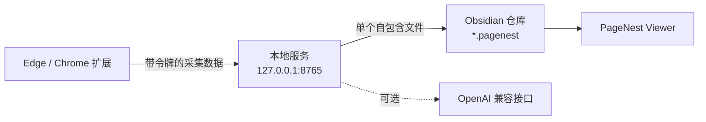

# PageNest

<p align="center"></p>

[English](README.md) · [快速安装](#快速安装) ·
[支持网站](docs/supported-sites.md) ·
[技术架构](docs/architecture.md) · [路线图](ROADMAP.md)

PageNest 是面向 Windows、Edge/Chrome 和 Obsidian 的本地优先网页收藏工具。
它在浏览器中采集文章，通过本地服务生成单个自包含 `.pagenest` 离线页面，
再由 Obsidian 查看器安全打开。智能整理是可选功能，可连接 OpenAI Chat
Completions 兼容接口。

> PageNest 由三个必要组件组成：浏览器扩展、Windows 本地服务、Obsidian
> 查看器。只安装浏览器扩展不能完成收藏和阅读。

## 主要功能

- 将正文、排版、图片、GIF、链接和支持的视频保存到单个 `.pagenest` 文件。
- 原网页失效或断网后，已嵌入内容仍可阅读。
- 保留图片原位、标题层级、代码块、外部仓库链接和独立收藏备注。
- 支持普通文章，并为飞书、微信、CSDN 和 B站提供专用适配。
- 通过已登录浏览器读取飞书受保护图片，保留 Canvas 内容。
- 保存 B站视频信息，支持的媒体可合并为受限的 360p MP4。
- 动态扫描 Obsidian 仓库文件夹。
- 提供仅保存原文、AI 文字整理和 AI 图文整理三种模式。
- AI 接口失败时仍保存原文和已下载图片。

## 三个组件怎样协作



扩展负责读取当前网页，本地服务负责清理、下载、整理和写入文件，Obsidian
插件负责注册 `.pagenest` 扩展名并在受限 iframe 中显示离线页面。

详细边界见[架构与数据流](docs/architecture.md)。

## 快速安装

### 环境要求

- Windows 10 或 11
- Microsoft Edge 或 Google Chrome
- Obsidian 1.5.0 或更高版本

### 1. 双击 Windows 安装程序

1. 下载 `PageNest-Setup-1.7.4.exe` 和对应的 `.sha256` 文件。
2. 核对校验值后双击安装程序。
3. 选择一个已经包含 `.obsidian` 文件夹的 Obsidian 知识库。

安装程序已经封装 Python 运行环境和本地服务，会自动生成随机连接令牌、配置
扩展目录、把 PageNest Viewer 安装到所选知识库，并默认设置为登录 Windows 后
启动。普通用户无需安装 Python，也不用手工编辑 `.env`。

### 2. 安装浏览器扩展

1. 打开 `edge://extensions/` 或 `chrome://extensions/`。
2. 开启“开发人员模式”。
3. 点击“加载解压缩的扩展”，选择：

   ```text
   %LOCALAPPDATA%\Programs\PageNest\Extension
   ```

4. 按需把 PageNest 固定到工具栏；本地服务连接已经配置完成。

浏览器商店正式上架前暂时采用解压缩扩展方式；安装程序会为这份解压缩扩展写入
令牌。商店安装版只有在正式安装包写入 Chrome/Edge 固定扩展 ID 后才能自动配对，
因此当前预发布商店包还不能宣传为完整的“三步安装”。

### 3. 在 Obsidian 中启用查看器

1. 运行安装程序后重启 Obsidian。
2. 打开“设置 → 第三方插件”。
3. 启用 **PageNest Viewer**。

安装程序已经把查看器复制到所选知识库。没有启用查看器时，Obsidian 不知道
怎样显示 `.pagenest` 文件。旧版生成的 `.hermes` 文件仍可继续打开。

## `.pagenest` 是什么

`.pagenest` 是经过清理的 UTF-8 自包含 HTML 文档，图片和支持的媒体直接嵌在
文件内。它不是加密格式，更接近“离线收藏成品”，而不是用于继续编辑的
Markdown 笔记。

PageNest Viewer 同时注册旧 `.hermes` 扩展名，因此改名前保存的收藏仍可
打开。

独立扩展名让 Obsidian 可以调用受限的 PageNest Viewer，也为将来的格式版本和
索引信息留出空间。应急时可以复制一份并改名为 `.html` 使用浏览器打开，但
Obsidian 查看器才是正式支持的阅读方式。

## 支持网站

| 网站 | 当前能力 |
| --- | --- |
| 普通文章网站 | 正文、标题层级、图片、链接、代码和尽力保留的排版 |
| 飞书文档 | 虚拟区块、登录图片、嵌入文档、Canvas 兜底 |
| 微信公众号 | 正文清理、懒加载图片和占位图过滤 |
| CSDN | 文章排版、代码配色、折叠/复制和外部仓库链接 |
| B站 | 视频页、专栏、动态、元数据和支持的媒体采集 |

完整说明见[网站支持矩阵](docs/supported-sites.md)。

## 浏览器权限

| 权限 | 用途 |
| --- | --- |
| `activeTab` | 识别并采集用户主动打开的网页 |
| `scripting` | 向当前网页注入提取器和网站适配器 |
| `storage` | 保存本地服务地址、令牌和用户设置 |
| `clipboardWrite` | 用户主动操作时复制路径或代码 |
| `<all_urls>` | 支持任意文章网站和页面内签名资源 |

网页内容只发送到用户配置的本地服务；只有用户主动选择 AI 模式时，才会发送到
用户配置的智能整理接口。项目没有遥测和分析代码。

## 安全设计

- 本地服务只监听 `127.0.0.1:8765`。
- API 必须携带本地令牌。
- CORS 只接受 Chromium 扩展来源。
- 默认阻止环回、局域网、链路本地和云元数据下载地址。
- 每次重定向都会重新验证，并在下载过程中限制大小。
- 限制请求体、正文、图片、媒体、数量和并发任务。
- 查看器不执行收藏网页脚本，也不加载远程图片。
- 代码复制使用每次渲染随机生成的消息通道。

详情见 [SECURITY.md](SECURITY.md) 和 [PRIVACY.md](PRIVACY.md)。

## 开发与测试

```powershell
python -m venv local-server\.venv
local-server\.venv\Scripts\python -m pip install -r local-server\requirements-dev.txt
local-server\.venv\Scripts\python -m pytest -q

Get-ChildItem extension,obsidian-plugin,tests -Recurse -Filter *.js |
  ForEach-Object { node --check $_.FullName }
Get-ChildItem tests -Filter "test_*.js" |
  ForEach-Object { node $_.FullName }
```

发布打包与验收见[发布检查清单](docs/release-checklist.md)。

## 项目状态

组件兼容关系见[版本兼容说明](docs/version-compatibility.md)，后续计划见
[ROADMAP.md](ROADMAP.md)。

## 参与贡献

提交问题或代码前请阅读 [CONTRIBUTING.md](CONTRIBUTING.md)。不要上传私人网页、
知识库内容、API Key 或未脱敏日志。

## License

[MIT](LICENSE)
