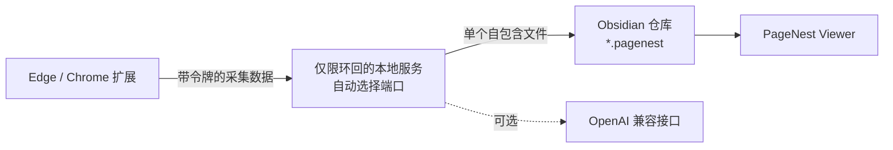

<p align="center"></p>
<h1 align="center">PageNest</h1>
<p align="center"><strong>把完整网页保存进 Obsidian，成为单个可离线阅读的文件。</strong></p>
<p align="center">保留正文、原位图片、代码、链接、GIF 和支持的视频；数据留在本地，用户无需安装 Python。</p>

<p align="center">
  <a href="https://github.com/WYuHuai/PageNest/actions/workflows/ci.yml"></a>
  
  
  
  <a href="LICENSE"></a>
</p>

<p align="center">
  <a href="README.md">English</a> ·
  <a href="https://github.com/WYuHuai/PageNest/releases">下载</a> ·
  <a href="#三步安装">安装</a> ·
  <a href="docs/supported-sites.md">支持网站</a> ·
  <a href="docs/troubleshooting.md">故障排查</a>
</p>

PageNest 是面向 Windows、Edge/Chrome 和 Obsidian 的本地优先网页收藏工具。
在浏览器里点击一次，即可在知识库中得到一个自包含的 `.pagenest` 离线页面。
智能整理是可选功能，可连接 OpenAI Chat Completions 兼容接口；普通收藏不需要
AI。

## 三步安装

**环境要求：** Windows 10 或 11、Microsoft Edge 或 Google Chrome，以及
Obsidian 1.5.0 或更高版本。

### 1. 安装 PageNest

从 [GitHub Releases](https://github.com/WYuHuai/PageNest/releases) 下载
`PageNest-Setup-1.8.0.exe` 和对应的 `.sha256` 文件，核对校验值后运行安装程序，
再选择一个现有的 Obsidian 知识库。

安装程序已经封装 Python 运行环境和本地服务，会自动生成随机连接令牌、配置
扩展、把 PageNest Viewer 安装到所选知识库，并设置为登录 Windows 后启动。
普通用户无需安装 Python，也不用手工编辑 `.env`。

### 2. 添加浏览器扩展

浏览器商店版本通过审核前，请打开 `edge://extensions/` 或
`chrome://extensions/`，开启**开发人员模式**，点击**加载解压缩的扩展**，选择：

```text
%LOCALAPPDATA%\Programs\PageNest\Extension
```

这份扩展已经与本地服务自动配对。

### 3. 启用 Obsidian 查看器

重启 Obsidian，打开**设置 → 第三方插件**，启用 **PageNest Viewer**。安装程序
已经把它复制到所选知识库。

### 收藏第一个网页

1. 在 Edge 或 Chrome 打开一篇文章，然后点击 PageNest。
2. 选择知识库文件夹，再点击**保存到 Obsidian**。
3. 在 Obsidian 中打开新生成的 `.pagenest` 文件。

如果扩展无法连接本地服务，或文件没有出现，请先看[故障排查](docs/troubleshooting.md)。

## 实际效果


## 主要功能

- 将正文、排版、图片、GIF、链接和支持的视频保存到单个 `.pagenest` 文件。
- 原网页失效或断网后，已嵌入内容仍可阅读。
- 保留图片原位、标题层级、代码块、外部仓库链接和独立收藏备注。
- 支持普通文章，并为飞书、微信、CSDN 和 B站提供专用适配。
- 通过已登录浏览器读取飞书受保护图片，保留 Canvas 内容。
- 保存 B站视频信息，支持的媒体可合并为受限的 360p MP4。
- 动态扫描 Obsidian 仓库文件夹。
- 提供仅保存原文、AI 文字整理和 AI 图文整理三种模式。
- AI 接口失败时仍保存原文和已下载图片。

## 三个组件怎样协作



扩展负责读取当前网页，本地服务负责清理、下载、整理和写入文件，Obsidian
插件负责注册 `.pagenest` 扩展名并在受限 iframe 中显示离线页面。

详细边界见[架构与数据流](docs/architecture.md)。

## `.pagenest` 是什么

`.pagenest` 是经过清理的 UTF-8 自包含 HTML 文档，图片和支持的媒体直接嵌在
文件内。它不是加密格式，更接近“离线收藏成品”，而不是用于继续编辑的
Markdown 笔记。

PageNest Viewer 同时注册旧 `.hermes` 扩展名，因此改名前保存的收藏仍可
打开。

独立扩展名让 Obsidian 可以调用受限的 PageNest Viewer，也为将来的格式版本和
索引信息留出空间。应急时可以复制一份并改名为 `.html` 使用浏览器打开，但
Obsidian 查看器才是正式支持的阅读方式。

## 支持网站

| 网站 | 当前能力 |
| --- | --- |
| 普通文章网站 | 正文、标题层级、图片、链接、代码和尽力保留的排版 |
| 飞书文档 | 虚拟区块、登录图片、嵌入文档、Canvas 兜底 |
| 微信公众号 | 正文清理、懒加载图片和占位图过滤 |
| CSDN | 文章排版、代码配色、折叠/复制和外部仓库链接 |
| B站 | 视频页、专栏、动态、元数据和支持的媒体采集 |

完整说明见[网站支持矩阵](docs/supported-sites.md)。

## 浏览器权限

| 权限 | 用途 |
| --- | --- |
| `activeTab` | 识别并采集用户主动打开的网页 |
| `scripting` | 向当前网页注入提取器和网站适配器 |
| `storage` | 保存本地服务地址、令牌和用户设置 |
| `clipboardWrite` | 用户主动操作时复制路径或代码 |
| `<all_urls>` | 支持任意文章网站和页面内签名资源 |

网页内容只发送到用户配置的本地服务；只有用户主动选择 AI 模式时，才会发送到
用户配置的智能整理接口。项目没有遥测和分析代码。

## 安全设计

- 本地服务只监听 `127.0.0.1`。Windows 安装器会从 `8765`、`18765`、
  `28765` 中选择第一个可用端口，商店扩展会自动尝试同一组端口。
- API 必须携带本地令牌。
- CORS 只接受 Chromium 扩展来源。
- 默认阻止环回、局域网、链路本地和云元数据下载地址。
- 每次重定向都会重新验证，并在下载过程中限制大小。
- 限制请求体、正文、图片、媒体、数量和并发任务。
- 查看器不执行收藏网页脚本，也不加载远程图片。
- 代码复制使用每次渲染随机生成的消息通道。

详情见 [SECURITY.md](SECURITY.md) 和 [PRIVACY.md](PRIVACY.md)。

## 开发与测试

```powershell
python -m venv local-server\.venv
local-server\.venv\Scripts\python -m pip install -r local-server\requirements-dev.txt
local-server\.venv\Scripts\python -m pytest -q

Get-ChildItem extension,obsidian-plugin,tests -Recurse -Filter *.js |
  ForEach-Object { node --check $_.FullName }
Get-ChildItem tests -Filter "test_*.js" |
  ForEach-Object { node $_.FullName }
```

发布打包与验收见[发布检查清单](docs/release-checklist.md)。

## 项目状态

组件兼容关系见[版本兼容说明](docs/version-compatibility.md)，后续计划见
[ROADMAP.md](ROADMAP.md)。

## 参与贡献

提交问题或代码前请阅读 [CONTRIBUTING.md](CONTRIBUTING.md)。不要上传私人网页、
知识库内容、API Key 或未脱敏日志。

## License

[MIT](LICENSE)
