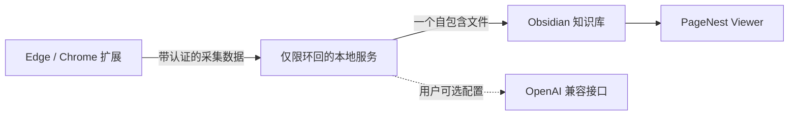

<h1 align="center">PageNest</h1>

<strong>收藏的是网页，不只是文字。</strong>

把网页保存为一个自包含的 <code>.pagenest</code> 文件，再用专属网页模式 Viewer 直接在 Obsidian 里打开。

  
  
  
  
  

  <a href="README.md">English</a> ·
  <a href="https://github.com/WYuHuai/PageNest/releases">下载</a> ·
  <a href="#三步安装">安装</a> ·
  <a href="docs/supported-sites.md">支持网站</a> ·
  <a href="docs/troubleshooting.md">故障排查</a>

PageNest 是面向 Windows、Edge/Chrome 和 Obsidian 的本地优先网页收藏工具。
在浏览器中点击扩展，即可在知识库内生成一个可移动的 `.pagenest` 文件，不需要
旁边再带一个附件文件夹。

## 不把网页压扁成 Markdown

大多数网页剪藏器的目标，是把网页转换成一篇 Markdown 笔记。PageNest 选择另一条
路线：把采集到的页面保存成离线文档，再由 Obsidian 中的专属 Viewer 以网页模式阅读。

| | 常见 Markdown 剪藏器 | PageNest |
| --- | --- | --- |
| 保存结果 | 转换后的 `.md` 笔记 | 自包含的 `.pagenest` 页面 |
| 图片与已加载媒体 | 外链或附件目录 | 可用时嵌入页面文件 |
| 在 Obsidian 中阅读 | Markdown 文档 | 专属网页模式 Viewer |
| 搬运收藏 | 笔记与附件需要一起移动 | 只移动一个文件 |
| AI 要求 | 取决于具体工具 | 普通收藏不需要 AI |

PageNest 不承诺对所有网站逐像素复刻。它的目标是保留更多有用的网页阅读体验，同时
让收藏保持本地、可移动，并能直接在你的 Obsidian 知识库中阅读。

网页仍然像网页：正文、图片、代码、链接、排版和收藏备注都留在一个可移动文件里。

## PageNest 会保留什么

- 文章结构、原位图片、GIF、表格、代码块、链接、支持的媒体和收藏备注。
- 为小红书、古月居、飞书、微信、CSDN、B站提供专用适配，其他网站使用通用文章采集。
- 用户在 Edge/Chrome 中主动打开的本地 HTML，包括当前渲染 DOM 和浏览器可读图片。
- 支持的小红书笔记中当前已加载的评论与图片轮播。
- 重复收藏保护和原子写入；可选 AI 整理失败也不会阻止保存原网页。

## 三步安装

> 当前平台状态：真实工作流已在 Windows 11 实机与 Windows CI 中测试，自动化
> Windows Sandbox 安装冒烟通过；可持久化干净 Windows 11 虚拟机的重启登录流程
> 尚未完成，Windows 10 尚未完整验证。

### 1. 安装 PageNest

从 [GitHub Releases](https://github.com/WYuHuai/PageNest/releases) 下载
`PageNest-Setup-1.8.0.exe` 和校验文件，核对 SHA-256 后运行安装程序，并选择一个
已有的 Obsidian 知识库。

- 不需要安装 Python。
- 不需要安装 Node.js。
- 不需要手工设置 token。
- 安装完成后 Service 自动启动，并在登录 Windows 后自动启动。

安装器目前没有 Authenticode 签名，Windows SmartScreen 可能显示**未知发布者**。
PageNest 不要求关闭 Microsoft Defender。

### 2. 加载浏览器扩展

Edge 扩展商店版本正式上线前：

1. 打开 `edge://extensions/`（Chrome 使用 `chrome://extensions/`）。
2. 开启**开发人员模式**。
3. 点击**加载解压缩的扩展**。
4. 选择 `%LOCALAPPDATA%\Programs\PageNest\Extension`。

### 3. 启用 PageNest Viewer

重启 Obsidian，打开**设置 → 第三方插件**，启用 **PageNest Viewer**。随后打开网页，
点击 PageNest，再点击**保存到 Obsidian**。

详细恢复步骤见[安装说明](docs/安装说明.html)和[故障排查](docs/troubleshooting.md)。

## 收藏并打开一个网页

1. 在 Edge 或 Chrome 中打开支持的网页。
2. 打开 PageNest，确认保存位置，点击**保存到 Obsidian**。
3. 在所选知识库文件夹中找到新生成的 `.pagenest` 文件。
4. 在 Obsidian 中打开它，PageNest Viewer 会渲染离线页面。

收藏本地 HTML 前，请先在扩展详情中开启**允许访问文件网址**。以后需要更换知识库时，
使用 **PageNest → 设置 → 当前 Vault → 更换仓库**；旧知识库中的文件不会被移动。

## 支持网站

| 网站或页面类型 | 当前支持 |
| --- | --- |
| 普通文章网站 | 正文、标题层级、图片、链接、代码和尽力保留的排版 |
| 本地 HTML | 当前渲染 DOM、代码、表格、链接和浏览器可读取图片 |
| 小红书 | 图文笔记、图片轮播、异步内容和当前已加载的结构化评论；尽力支持 |
| 古月居 | 当前文章 DOM 和旧 `.detail-fuwenben .html`，包括正文与图片 |
| 飞书文档 | 虚拟区块、登录图片、嵌入文档和 Canvas 视觉兜底 |
| 微信公众号 | 正文清理、懒加载图片和占位图过滤 |
| CSDN | 文章排版、代码配色/操作和外部仓库链接 |
| B站 | 视频页、专栏、动态、元数据和支持的媒体采集 |

网站结构可能随时变化，完整说明见[网站支持矩阵](docs/supported-sites.md)。

## 截图

以下画面来自真实 PageNest UI 或真实渲染器，并使用脱敏示例内容，不包含用户路径、
token、API Key 或账号隐私。

<table>
  <tr>
    <td width="50%"> 保存页与底部悬浮导航</td>
    <td width="50%"> Service、Vault 更换与刷新入口</td>
  </tr>
  <tr>
    <td width="50%"> 脱敏小红书轮播与结构化评论</td>
    <td width="50%"> 本地 HTML 保存为单个离线文件</td>
  </tr>
</table>

## 工作原理

扩展负责提取当前页面；本地服务验证请求、清理内容、下载允许的资源、按需整理并原子
写入文件；PageNest Viewer 在受限 iframe 中显示离线成品。

## 隐私与安全

- Service 只绑定 `127.0.0.1`，API 需要本地 bearer token。
- CORS 只接受允许的扩展来源。
- 默认拒绝不安全协议、凭据、内网地址、云元数据地址和不安全重定向。
- 限制请求体、正文、图片、媒体、项目数量和并发任务。
- Viewer 不执行收藏网页的脚本。
- 代码复制使用每次渲染随机生成的消息通道。

完整边界见[安全说明](SECURITY.md)、[隐私说明](PRIVACY.md)和
[架构文档](docs/architecture.md)。

## 已知限制

- Windows 10 尚未完整验证；可持久化干净 Windows 11 虚拟机的重启登录流程尚未完成。
- 安装器未签名，SmartScreen 可能提示**未知发布者**。
- 网站 DOM 改版可能临时影响专用适配器。
- 小红书只保存网站当前已经加载的评论，登录状态尚未完整测试。
- DRM、受保护资源、过期链接或严格防盗链可能导致部分媒体无法收藏。
- 复杂本地 HTML 不执行源 JavaScript，原始 CSS 不保证 1:1 复现。

## 文档与参与贡献

- [安装说明](docs/安装说明.html)
- [故障排查](docs/troubleshooting.md)
- [架构与数据流](docs/architecture.md)
- [版本兼容说明](docs/version-compatibility.md)
- [路线图](ROADMAP.md)
- [参与贡献](CONTRIBUTING.md)

欢迎提交聚焦的问题报告和 Pull Request。请勿上传私人网页、知识库内容、API Key
或未脱敏日志。

## License

[MIT](LICENSE)
