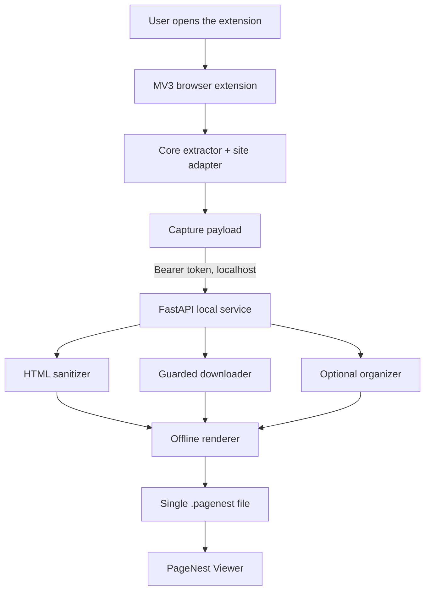

# Architecture and data flow

PageNest keeps browser privileges, filesystem access, and offline rendering in
separate components.



## Components

### Browser extension

The Manifest V3 extension uses plain JavaScript. `extension/core/` owns generic
capture behavior; `extension/adapters/` owns site-specific detection and
preparation. Every registered adapter exposes:

```text
detect / preparePage / extract / cleanup / validate
```

The extension runs only after a user opens its popup. It captures the current
HTTP(S) page and sends structured data to the configured local service.

### Local service

The FastAPI service binds to `127.0.0.1:8765`. The public Windows installer
bundles its Python 3.11 runtime, so end users do not install Python.

- `main.py`: authenticated HTTP endpoints and collection concurrency.
- `models.py`: bounded request models.
- `network.py`: URL validation, redirect validation, and streamed byte limits.
- `images.py` / `media.py`: resource persistence and placement.
- `sanitizer.py`: untrusted HTML cleanup.
- `rendering.py`: self-contained offline page rendering.
- `organizers.py`: optional OpenAI-compatible organization.
- `storage.py`: collection orchestration and atomic vault writes.

The organizer is optional. Its failure is recorded but does not block original
content and downloaded images from being saved.

### Obsidian viewer

The desktop-only plugin registers `.pagenest` and the legacy `.hermes`
extension with Obsidian. It renders the file inside a sandboxed iframe without
`allow-same-origin`. A random channel token
authorizes copy requests for the current render.

## Trust boundaries

| Boundary | Protection |
| --- | --- |
| Website → extension | Site adapters validate the extracted capture |
| Extension → service | Bearer token, restricted CORS, bounded request models |
| Service → network | HTTP(S)-only URL validation, DNS/IP checks, redirect checks, byte limits |
| Service → vault | Resolved paths constrained to the configured vault |
| `.pagenest` → Obsidian | Sanitized HTML, restricted iframe, no remote images |
| Service → AI endpoint | Disabled by default; user-configured endpoint and explicit mode |

## `.pagenest` document

The current format is a UTF-8 HTML document containing sanitized article
markup, local styles, metadata, and embedded data URLs. It is intentionally
single-file so moving or backing up one collection cannot orphan an asset
folder.

The trade-off is file size: a video or many large images make the whole file
larger, and changing one embedded resource requires rewriting the document.
